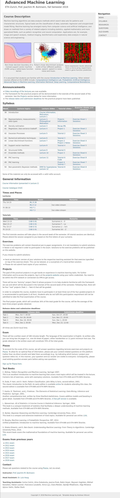

# Advanced Machine Learning

[Course website](https://ml2.inf.ethz.ch/courses/aml/)

[Project website](https://aml.ise.inf.ethz.ch/login)

## Course materials

### Lecture slides and notes

* [Lecture 1](Lecture/aml19_lecture_01.pdf)
    * [Course info](Lecture/aml19_course_information.pdf)
    * [Motivation](Lecture/aml19_motivation.pdf)
* [Lecture 2 Representations, measurements, data types](Lecture/aml19_lecture_02.pdf)
    * [Philosophical Motivation](Lecture/aml19_philosophical_motivation.pdf)
* [Lecture 3 Density estimation](Lecture/aml19_lecture_03.pdf)
* [Lecture 4 Regression, bias-variance tradeoff](Lecture/aml19_lecture_04.pdf)
* [Lecture 5 Gaussian Processes](Lecture/aml19_lecture_05.pdf)
* [Lecture 6 Numerical estimation techniques](Lecture/aml19_lecture_06.pdf)
* [Lecture 7 Linear discriminant functions](Lecture/aml19_lecture_07.pdf)
* [Lecture 8 Support vector machines](Lecture/aml19_lecture_08.pdf)
* [Lecture 9 Structured SVMs](Lecture/aml19_lecture_09.pdf)
* [Lecture 10 Ensemble methods](Lecture/aml19_lecture_10.pdf)
* [Lecture 11 PAC learning](Lecture/aml19_lecture_11.pdf)
* [Lecture 12 Nonparametric Bayesian Methods](Lecture/aml19_lecture_12.pdf)
* [ERM for hyperplanes](Lecture/ERM-for-hyperplanes-2019-12-12.pdf)

### Exercises

* [Exercise 1](Exercise/exercise1.pdf)
    * [Solution](Exercise/solution1.pdf)
* [Exercise 2](Exercise/exercise2.pdf)
    * [Solution](Exercise/solution2.pdf)
* [Exercise 3](Exercise/exercise3.pdf)
    * [Solution](Exercise/solution3.pdf)
* [Exercise 4](Exercise/exercise4.pdf)
    * [Solution](Exercise/solution4.pdf)
* [Exercise 5](Exercise/exercise5.pdf)
    * [Solution](Exercise/solution5.pdf)
* [Exercise 6](Exercise/exercise6.pdf)
    * [Solution](Exercise/solution6.pdf)
* [Exercise 7](Exercise/exercise7.pdf)
    * [Solution](Exercise/solution7.pdf)
* [Exercise 8](Exercise/exercise8.pdf)
    * [Solution](Exercise/solution8.pdf)

### Tutorials

* [SVM](tutorial/tutorial-svm.pdf)
* [Recap IML Regression EM](tutorial/tutorial_regression_em.pdf)
* [Ensemble](tutorial/tutorial_ensemble.pdf)
* [Gaussian Process Model selection](tutorial/gp_model_selection.pdf)
* [Classification](tutorial/classification.pdf)
* [Bayesian Regression](tutorial/bayesian_regression.pdf)
* [Nonparametric Bayesian Methods and Clustering](tutorial/tutorial7.pdf)
* [Project](tutorial/Introduction_to_projects.pdf)
* [Project 1](tutorial/Project1.pdf)
* [Project 2](tutorial/task2_pres.pdf)
    * [Project 2](tutorial/task2_tutorial.pdf)
* [Project 3](tutorial/Project3.pdf)
* [Project 4](tutorial/task4.pdf)

[Random_forest nb](https://github.com/wyq977/wyq977.github.io/tree/master/ETH/aml/tutorial/Random_forest.ipynb)

### Literature

### Other

Proposed solution by others, no guarantee.
More detailed ones can be found in [vis solutions](https://exams.vis.ethz.ch/category/AdvancedMachineLearning)

* [vis wiki](https://wiki.vis.ethz.ch/Machine_Learning)
* [cheat sheet (zhj)](AML_cheatsheet-zhj.pdf)
* [cheat sheet](AML_cheatsheet.pdf)
* [network structure cheatsheet](AML_cheatsheet-network.pdf)
* [another cheat sheet](https://raw.githack.com/andbloch/eth-ml-cheat-sheet/master/document.pdf)
    This is gitraw rendered pdf and the corresponding repo can be found by looking at the url
* [another cheat sheet](https://raw.githack.com/efmkoene/AML-2018-cheatsheet/master/AML_cheatsheet.pdf)
* [another cheat sheet](https://raw.githack.com/plokchen/eth-ml-exam-summary/master/Main.pdf)
* [Exam 2011](past-exam/exam2011.pdf)
    * [solution](exam-proposed-solution/2011.pdf)
* [Exam 2012](past-exam/exam2012.pdf)
    * [solution](exam-proposed-solution/2012.pdf)
* [Exam 2013](past-exam/exam2013.pdf)
    * [solution](exam-proposed-solution/2013.pdf)
* [Exam 2014](past-exam/exam2014.pdf)
    * [solution](exam-proposed-solution/2014.pdf)
* [Exam 2015](past-exam/exam2015.pdf)
    * [solution](exam-proposed-solution/2015.pdf)
* [Exam 2016](past-exam/exam2016.pdf)
    * [solution](exam-proposed-solution/2016.pdf)
* [Exam 2017](past-exam/exam2017.pdf)
* [Exam 2018](past-exam/exam2018.pdf)

