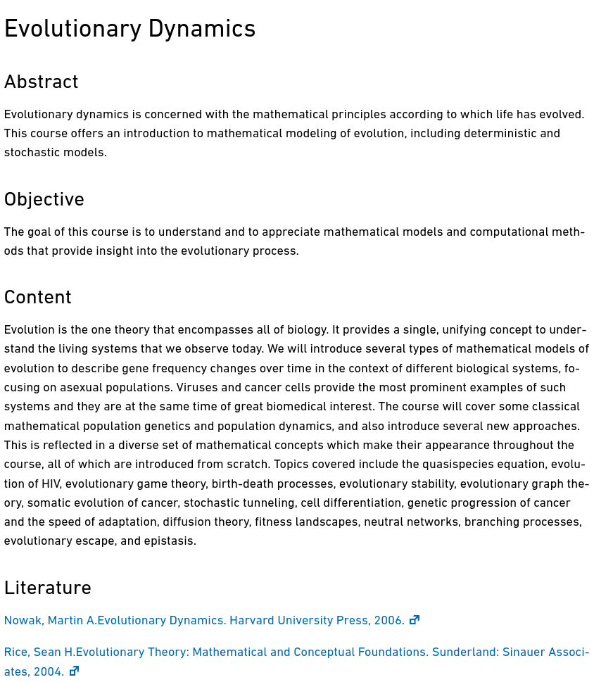

# Evolutionary Dynamics

[Course website](https://bsse.ethz.ch/cbg/teaching/EvoDyn.html)

## Summary

Feel free to [make a pull request](https://stackoverflow.com/questions/14680711/how-to-do-a-github-pull-request) to add to this section or email me directly!

* [Here](exam_transcript.pdf) is my exam summary for HS 2019 but you can find more on [vis community solutions](https://exams.vis.ethz.ch/) but you have to pay lol.
* [scanned notes by me (with some Chinese in between)](notes-evo-dym.pdf)
* [summary by zhj (pdf)](ed-zhj.pdf), [word](ed-zhj.docx)

## Oral Exam info.

Feel free to [make a pull request](https://stackoverflow.com/questions/14680711/how-to-do-a-github-pull-request) to add to this section or email me directly!

For the exam format, you are allowed to choose from one of the topics and Niko will start from there and continue to move on to other areas. He would not ask about detail derivation due to time limit but would go straight to the conclusion.

**Here are some information from ppl taking during HS 2019:**

Other#1:
Evolutionary escape chosen, asked about the coalescent time/event, how to get the exponetially distributed time, quasispecis

**Here are some information from ppl taking during HS 2018:**

> Celine: i do remember him asking what my favourite topic was so you could basically choose with which topic you want to start of. So I would recommend learning one topic very good even learning some formular by heart. In general he likes if you write things down, equations, drawing the dynamics of smth. E.g. i think there was one lecture about different types of dynamics (represented by special graphs, star, linear etc.) I remember him asking if i could name some and their advantages and disadvantages, so i drew down some graphs and explained what i new about them, i also told him which one i thought was the most realistic, i think he liked that :wink: I also had the cancer lecture, there I had to explain the dynamics, the probability of spreading or smth (i remember something which includes the mutation rate), i knew the equations by heart (luckily) and wrote it down. Then I had this lecture where you can have multiple mutations or smth (i dont remember the lecture but i was quite at the end), and i totally failed that but i managed to get a good grade anyway hahah. So as my last tip, dont be nervous if you dont know everything, he is pretty nice during the exam (regardless how he comes across during the lecture ;)) and he will help you out. The exam was really managable.

> Reto: As I remember the focus was more understanding, so intuitions were important. But the most basic equations you should know by heart and also be able to explain them. I guess it would be helpful to know the basic concepts of each lecture, because I think that he first asked quite broad about a topic, for example what is the quasi-species equation and what does it mean. Then he would go a bit more in depth, but generally he choses about two to three topics, so if you are not to save with one there will be at least be another one. Derivations are not that important, certainly not the complicated ones (also no time for those in the exam, luckily). Anyways, he was very kind, for example when he realizes you have no idea he goes to the next topic I also know of no one who did not pass.

> Hana: I'd say he mostly asks about definitions and important results. In my opinion you don't need to know any derivations, but it is fine to derive something on the spot if it is quick.  At the beginning I could choose one topic (I chose evolutionary graph theory), then he also asked about diffusion theory and coalescence.

## Course materials

### Lecture slides and notes

* [Lecture 0 Introduction](Lectures/00.pdf)
* [Lecture 1 What is evolution](Lectures/01.pdf)
* [Lecture 2 Quasispecies](Lectures/02.pdf)
* [Lecture 3 Stochastic models of finite populations](Lectures/03.pdf)
* [Lecture 4 Evolutionary dynamics of cancer](Lectures/04.pdf)
* [Lecture 5 Cancer progression](Lectures/05.pdf)
* [Lecture 6 Diffusion theory](Lectures/06.pdf)
* [Lecture 7 Evolutionary game theory](Lectures/07.pdf)
* [Lecture 8 Evolutionary games in finite populations](Lectures/08.pdf)
* [Lecture 9 Spatial tumour models](Lectures/09.pdf)
* [Lecture 10 Branching processes](Lectures/10.pdf)
* [Lecture 11 Evolutionary escape](Lectures/11.pdf)
* [Lecture 12 Coalescent theory](Lectures/12.pdf)
* [Lecture 13 Tumour archeology](Lectures/13.pdf)

### Exercises

* [Exercise 1](Exercises/Exercises1.pdf)
* [Exercise 2](Exercises/Exercises2.pdf)
* [Exercise 3](Exercises/Exercises3.pdf)
* [Exercise 4](Exercises/Exercises4.pdf)
* [Exercise 5](Exercises/Exercises5.pdf)
* [Exercise 6](Exercises/Exercises6.pdf)
* [Exercise 7](Exercises/Exercises7.pdf)
* [Exercise 8](Exercises/Exercises8.pdf)
* [Exercise 9](Exercises/Exercises9.pdf)
* [Exercise 10](Exercises/Exercises10.pdf)

### Literature

### Other

Two tutorials can be found under [here](https://github.com/wyq977/wyq977.github.io/tree/master/ETH/evolutionary-dynamics/)

