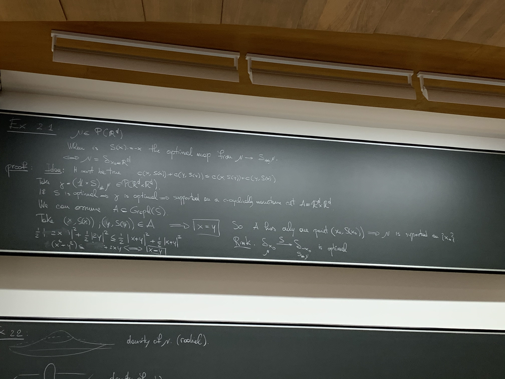
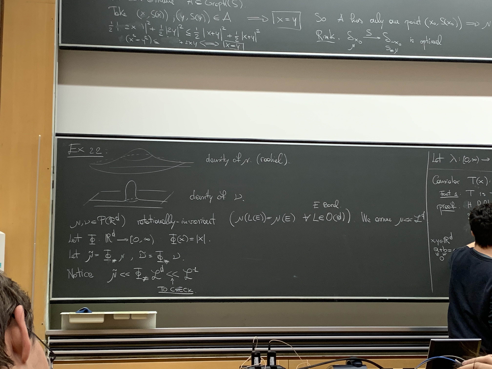
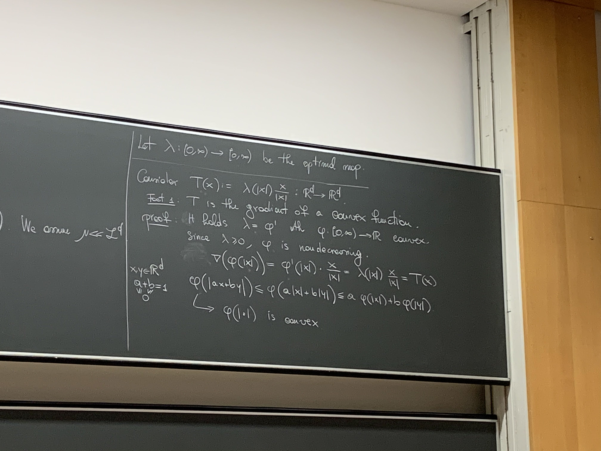
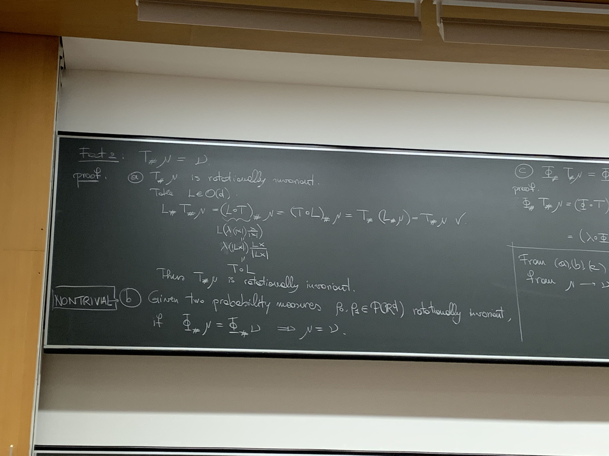
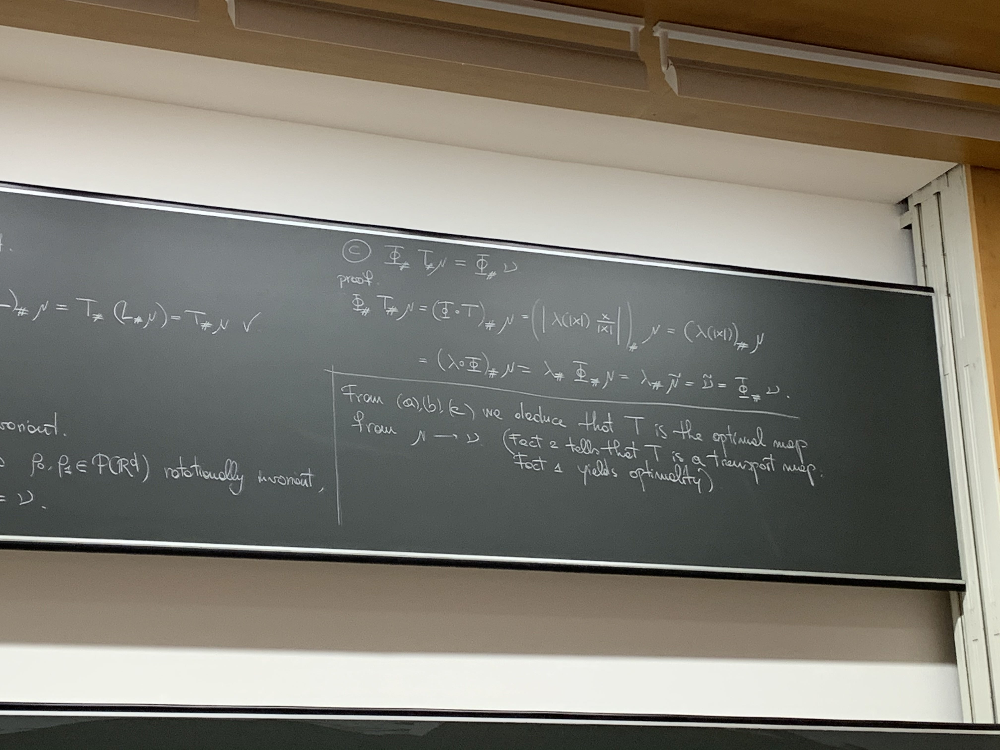
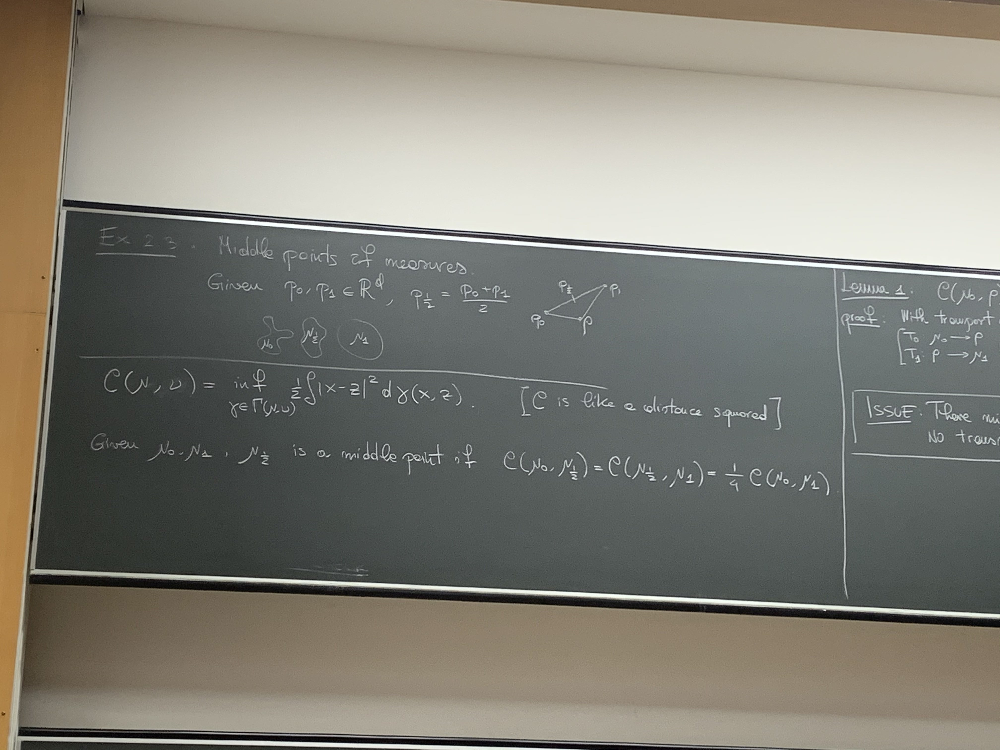
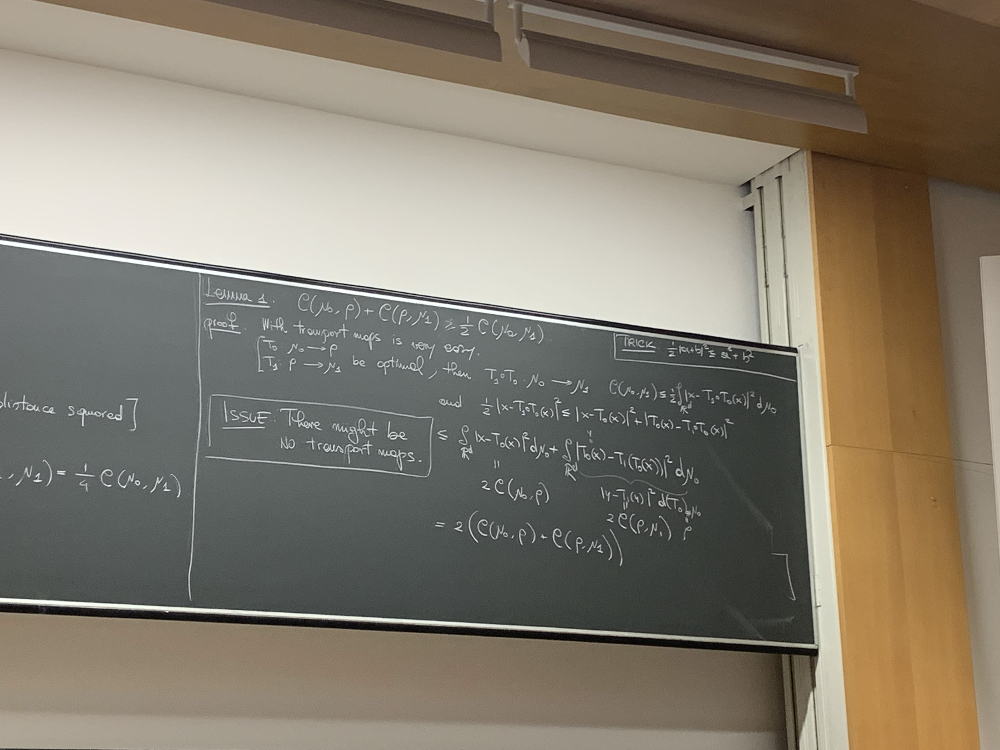

# Optimal Transport

## Course materials

### Lecture slides and notes

* [Lecture note](Opt_Trsprt.pdf)
* [Introduction to Optimal TransportMatthew Thorpe](Notes.pdf)
    Quite easy to follow, nice to start
* [Optimal Transport for Applied Mathematicians](OTAM-cvgmt.pdf)
* [OPTIMAL TRANSPORT AND CURVATURE](Optimal-Transport-and-Curvature.pdf)
### Exercises

* [Exercise 1](exercise_sheet1.pdf)
* [Exercise 2](exercise_sheet2.pdf)

### Tutorials

### Literature

### Other

